```{r global_options, include=FALSE}
knitr::opts_chunk$set(fig.width=14, fig.height=8, echo=TRUE, eval=TRUE, cache=TRUE,
                      warning=FALSE, message=FALSE)
library(ggplot2)
library(covidcast)
library(tidyverse)
library(tidyr) ## for pivot_wider() ?
library(devtools)
library(glmnet)
source("helpers.r")

## Location of your covidcast R package.
load_all("/home/shyun/repos/covidcast/R-packages/covidcast")
## load_all("~/Desktop/CMU/Projects/Delphi-Covid-19/delphi_repos/covidcast/R-packages/covidcast")

## Location to print plots to
outputdir = "./figures"
```

## Goal

Use various classifiers (e.g. l1-penalized and ridge logistic regression, and
SVM, xgboost), for a hotspot detection model.

## Data and model 

**Geographical levels** Two levels: state and county.

**Data** Between 2020-05-01 and 2020-08-25, take the 

- 7-day JHU case proportion (incidence rate),
- Various FB surveys (smoothed individual, smoothed community survey,
  smoothed household survey, smoothed weighted household survey).  
	 
Then, form a covariate matrix by time-lagging these by 0 through 28
days. Additionally, add features by calculating "slopes of JHU IR from the past
x days", where $x \in \{3,6,9,12,15..\}$.

The resulting covariate matrix is roughly 3162 by 193 at the state level, and 52093
by 193 at the county level. We have 953 different counties in our sample. 

**Response data**

- **1** if 25% increase of JHU IR in the one week period 22-28 days from now,
  compared to the past 1 week (-1 through -7 days) **and** the later 1-week
  period exceeds $20$.
- **0** otherwise.

**Training and test data** This is done by splitting the data into training/test
set at a ratio of 70%/30%, by geographical level. The training set is used for
training the hotspot model (e.g. for cross-validation of `glmnet()` or training
`svm()`), and the test data is used only for creating the ROC or adjusted ROC
curves.


**Models** L1- and L2- penalized logistic regression, SVM, xgboost.

**Cross-validation for `glmnet`** is done in a block-wise fashion **in time**;
five consecutive time blocks are used as test sets (folds).


## Results

### State

First, visualizing the hotspots for the state level data:

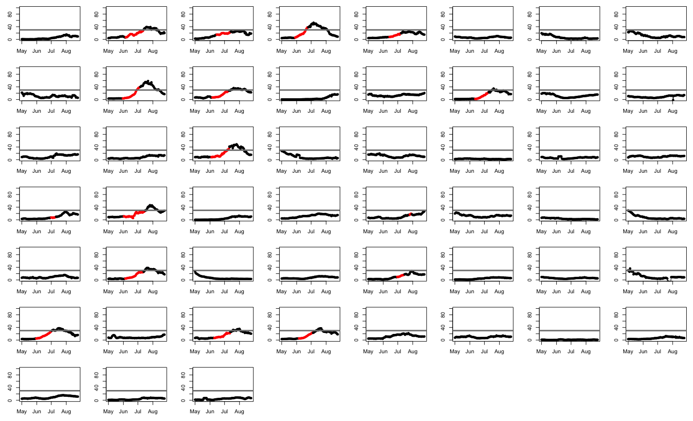

The distribution of 0's and 1's in the entire state level data is

<table class="table" style="width: auto !important; margin-left: auto; margin-right: auto;">
 <thead>
  <tr>
   <th style="text-align:left;"> Response </th>
   <th style="text-align:right;"> Count </th>
  </tr>
 </thead>
<tbody>
  <tr>
   <td style="text-align:left;"> 0 </td>
   <td style="text-align:right;"> 2705 </td>
  </tr>
  <tr>
   <td style="text-align:left;"> 1 </td>
   <td style="text-align:right;"> 457 </td>
  </tr>
</tbody>
</table>


training set:

<table class="table" style="width: auto !important; margin-left: auto; margin-right: auto;">
 <thead>
  <tr>
   <th style="text-align:left;"> Response </th>
   <th style="text-align:right;"> Count </th>
  </tr>
 </thead>
<tbody>
  <tr>
   <td style="text-align:left;"> 0 </td>
   <td style="text-align:right;"> 1906 </td>
  </tr>
  <tr>
   <td style="text-align:left;"> 1 </td>
   <td style="text-align:right;"> 326 </td>
  </tr>
</tbody>
</table>

test set

<table class="table" style="width: auto !important; margin-left: auto; margin-right: auto;">
 <thead>
  <tr>
   <th style="text-align:left;"> Response </th>
   <th style="text-align:right;"> Count </th>
  </tr>
 </thead>
<tbody>
  <tr>
   <td style="text-align:left;"> 0 </td>
   <td style="text-align:right;"> 799 </td>
  </tr>
  <tr>
   <td style="text-align:left;"> 1 </td>
   <td style="text-align:right;"> 131 </td>
  </tr>
</tbody>
</table>


Using `n_ahead=28`, the performances of four different classifiers can be
visualized as ROC curves. Here, thick transparent lines are the results using
Facebook data, and thin lines are those excluding Facebook data.

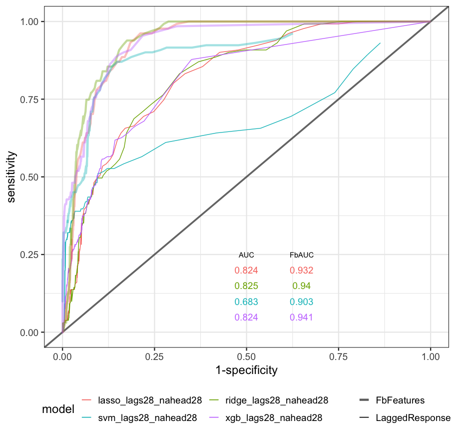{width=60%}

We can also see population-weighted ROC curves:

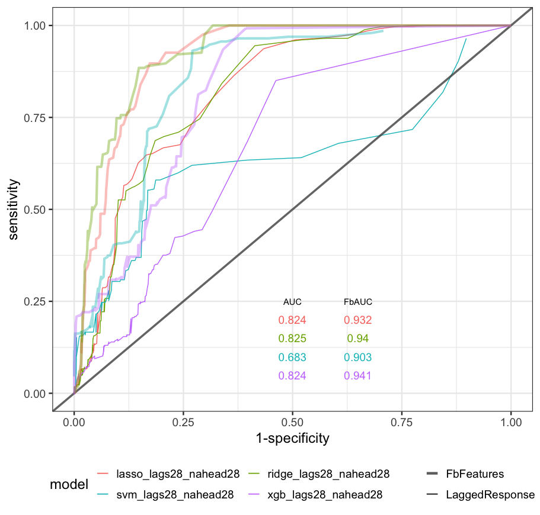{width=60%}

Given the class imbalance, we can look at precision-recall plots:

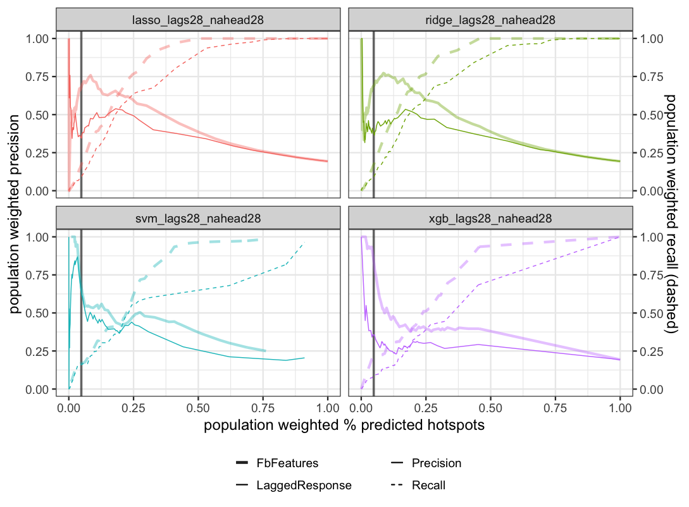{width=60%}

And now the same precision-recall plot, but considering a logged x axis:

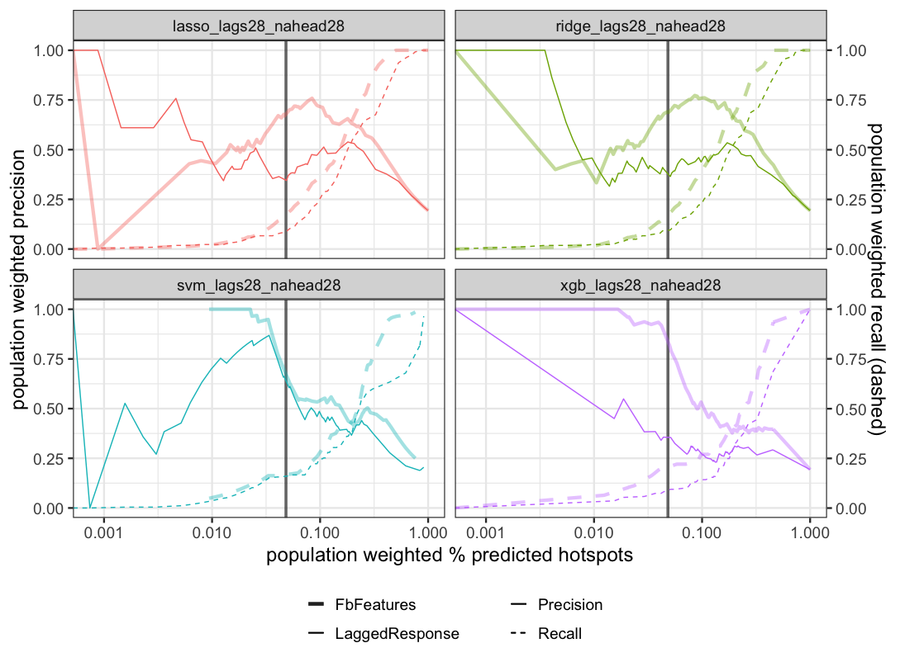{width=60%}

Now, choosing a summary statistic to measure the *advantage* in performance
using Facebook data, we'll calculate *difference* in the area under the curve
(AUC) between the two versions, for each classifier, as a function of **how far
ahead hotspots are defined as** i.e. for a range of `n_ahead`, in $\{10, \cdots,
30\}$:

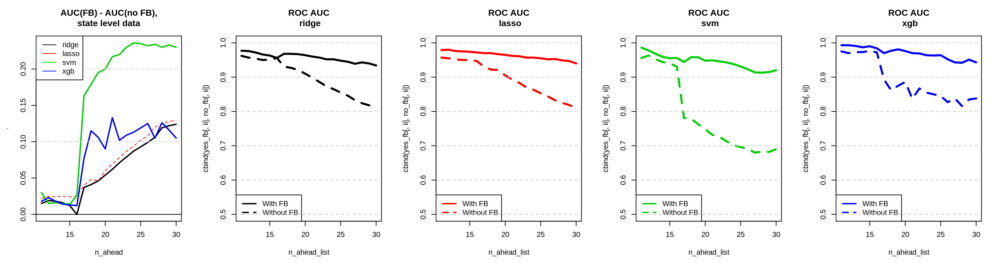

Interestingly, the advantage of using Facebook data increases as we try to predict a hotspot in a date further in the future. 

The analysis depends a bit on how the training/test split is made among geographical
regions. If we use a different random seed for splitting, the ROC curves can
differ quite a bit:

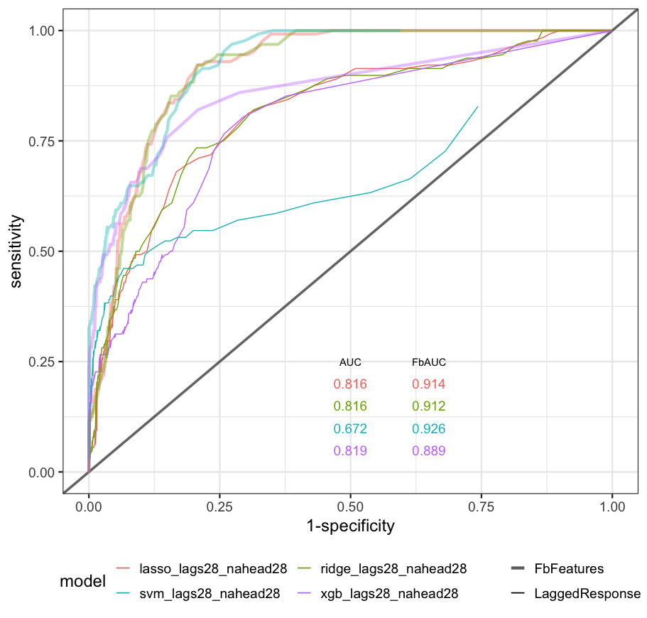{width=60%}

While the classifier performance varies by seed, the advantage that FB grants is
clearly always present.

### County

The numbers in the county level data are:

<table class="table" style="width: auto !important; margin-left: auto; margin-right: auto;">
 <thead>
  <tr>
   <th style="text-align:left;"> Response </th>
   <th style="text-align:right;"> Count </th>
  </tr>
 </thead>
<tbody>
  <tr>
   <td style="text-align:left;"> 0 </td>
   <td style="text-align:right;"> 43437 </td>
  </tr>
  <tr>
   <td style="text-align:left;"> 1 </td>
   <td style="text-align:right;"> 810 </td>
  </tr>
</tbody>
</table>


training set:

<table class="table" style="width: auto !important; margin-left: auto; margin-right: auto;">
 <thead>
  <tr>
   <th style="text-align:left;"> Response </th>
   <th style="text-align:right;"> Count </th>
  </tr>
 </thead>
<tbody>
  <tr>
   <td style="text-align:left;"> 0 </td>
   <td style="text-align:right;"> 30611 </td>
  </tr>
  <tr>
   <td style="text-align:left;"> 1 </td>
   <td style="text-align:right;"> 6063 </td>
  </tr>
</tbody>
</table>

test set

<table class="table" style="width: auto !important; margin-left: auto; margin-right: auto;">
 <thead>
  <tr>
   <th style="text-align:left;"> Response </th>
   <th style="text-align:right;"> Count </th>
  </tr>
 </thead>
<tbody>
  <tr>
   <td style="text-align:left;"> 0 </td>
   <td style="text-align:right;"> 12826 </td>
  </tr>
  <tr>
   <td style="text-align:left;"> 1 </td>
   <td style="text-align:right;"> 2593 </td>
  </tr>
</tbody>
</table>

Using `n_ahead=28`, the performances of four different classifiers can be
visualized as ROC curves. Here, thick transparent lines are the results using
Facebook data, and thin lines are those excluding Facebook data.

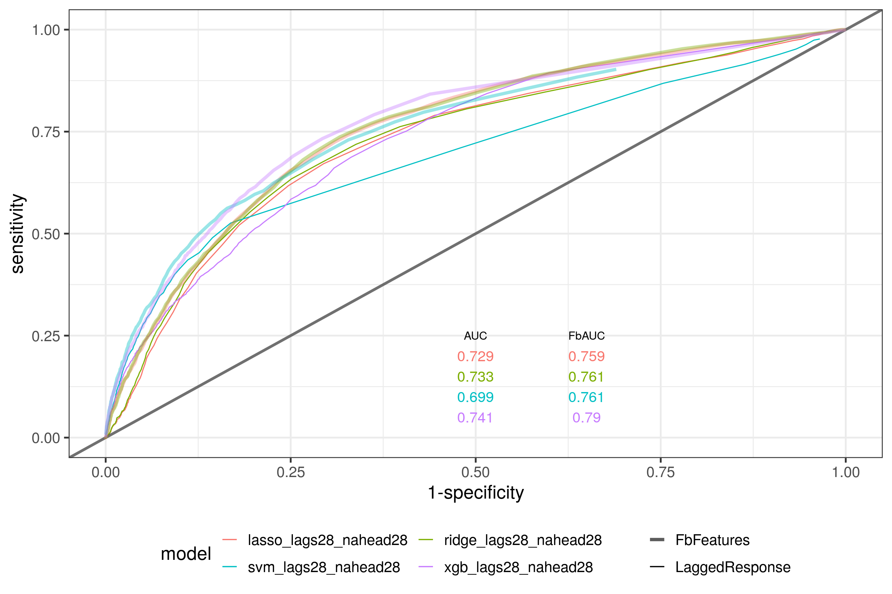{width=80%}

And population weighted:

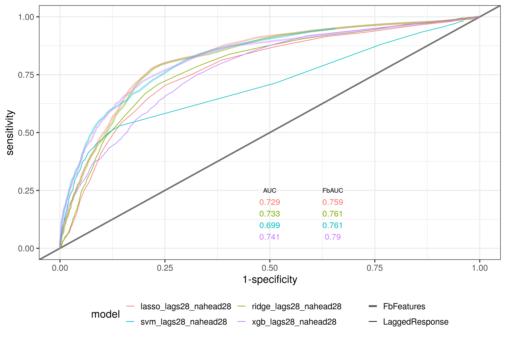{width=80%}

The precision-recall plot:

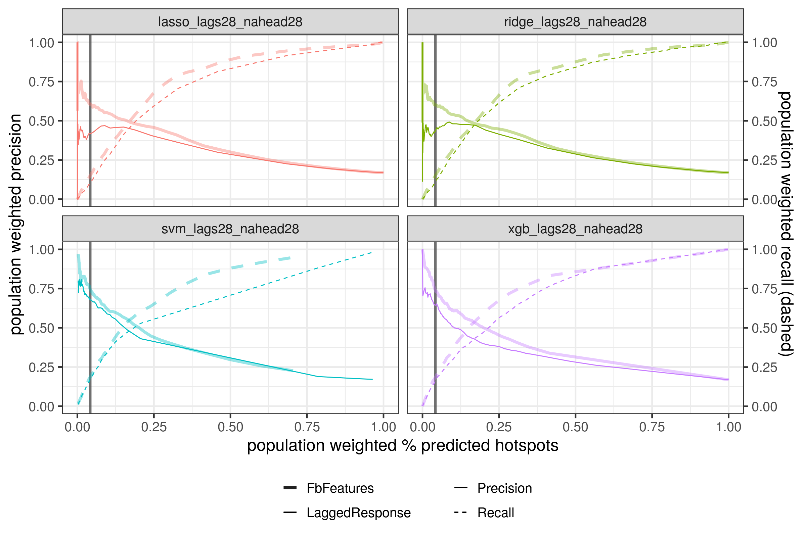{width=80%}

And the precision-recall plot considering a logged x axis:

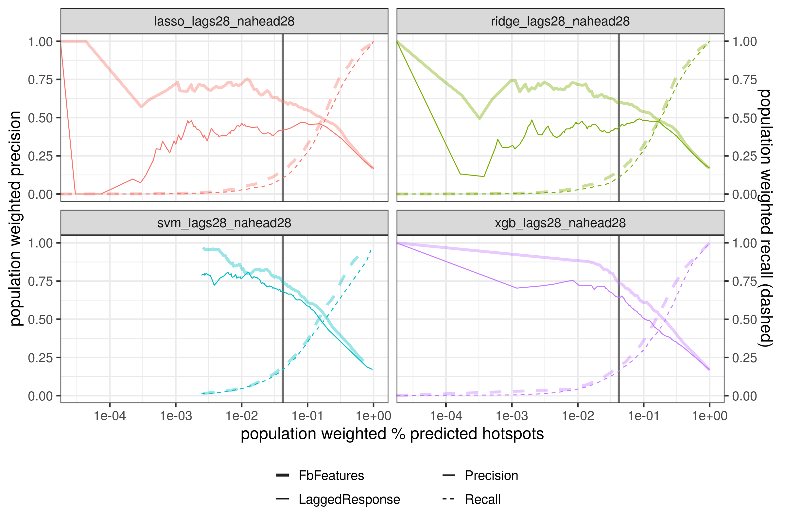{width=80%}

Now, choosing a summary statistic to measure the *advantage* in performance
using Facebook data, we'll calculate *difference* in the area under the curve
(AUC) between the two versions, for each classifier, as a function of **how far
ahead hotspots are defined as** i.e. for a range of `n_ahead`, in $\{10, \cdots,
30\}$:

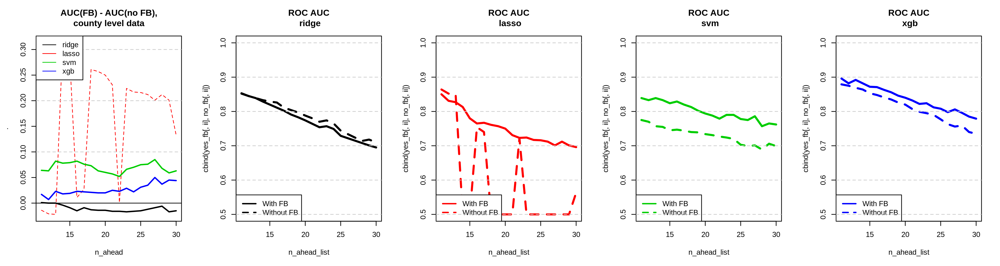


## Code

Some variables and functions:

- `lags` are the number of lagged values taken of the JHU cases and FB. Current
  default is `lags=28`. `slope = TRUE` adds slopes to the feature matrix that is composed by lagged values
- `n_ahead` is the number of days we want to look ahead, in forming the response
  data (0 or 1) for hotspot detection. Current default choice is `n_ahead=28`.
- We compare the $\bar y_2$ average of 1 week period ending `n_ahead` days from
  *now*, to the average $\bar y_1$ of the past 1 week period (again, from
  *now*). 
- We deem one time & region a "hotspot" if $\bar y_1$ is larger than $\bar y_2$
  by `threshold` percent (25\%).
- `covidcast_signals()` from the R package `covidcast` allows the data
  collection of multiple sources.
- `read_to_model()` further cleans + readies the data into a $y|X$ type matrix,
  to feed into functions like `glmnet()`.
- all the results are for `onset = FALSE`. If `onset = TRUE`, a hotspot (from the definition of our response variable) will only be considered a hotspot if it has not been a hotspot recently. 

First, we download and form the data.

```{r form-data, eval=TRUE}
## Setup
lags = 28
n_ahead = 21 ## 28
threshold = 0.25
geo_type = "county" ## or "county"
response = "confirmed_7dav_incidence_prop"
fn_response = response_diff_avg_1week_min20
fn_response_name = "response_diff_avg_1week_min20"
slope = TRUE
onset = FALSE
split_type = "geo"

## Read in data once
data_sources = c("indicator-combination", 
                 "fb-survey")
signals = c("confirmed_7dav_incidence_prop", 
            "smoothed_hh_cmnty_cli")
start_day = as.Date("2020-05-01")
end_day = as.Date("2020-08-30")
signals = data.frame(data_sources = data_sources, signals = signals)
suppressMessages({
  mat = covidcast_signals(signals,
                          start_day = start_day, end_day = end_day, geo_type = geo_type)
})
mat <- mat %>% select(geo_value, time_value, signal, data_source, value)

## Form the y|X matrix
source('helpers.r')
df_model <- ready_to_model(mat, lags, n_ahead, response, slope, fn_response, threshold, onset)
df_model %>% names() %>% print()
## save(df_model, mat, s, n_ahead, threshold, geo_type, response, fn_response, fn_response_name, slope, onset, split_type,
##      file = file.path(outputdir, "data-county.Rdata"))
## load(file = file.path(outputdir, "data-county.Rdata"))

## Further split into training and test
geo_split_seed = 10
geo_cv_split_seed = 100
splitted <- sample_split_geo(df_model, pct_test = 0.3, seed = geo_split_seed)

## See the distribution of 1's and 0's
df_model %>% select(resp) %>% table() %>% print()
splitted$df_train %>% select(resp) %>% table() %>% print()
splitted$df_test %>% select(resp) %>% table() %>% print()

foldid <- make_foldid_geo(splitted$df_train, nfold = 5, geo_cv_split_seed)
for(ifold in 1:nfold){
  splitted$df_train[which(foldid==ifold),] %>% select(resp) %>% table() %>% print()
}
```

Now, fit the hot-spot models and visualize the model performances.

```{r make-plots, eval=FALSE}
make_plots(destin = outputdir,
           splitted, lags, n_ahead, geo_type, fn_response_name, threshold, slope, split_type, onset, geo_cv_split_seed)
```

Also visualize the 1's and 0's in the state level data (highlighting by each CV
fold *and* test data, in different color boxes):

```{r viz-response, eval=FALSE}
## geos = df_model %>% select(geo_value) %>% unlist() %>% unique()
foldid <- make_foldid_geo(splitted$df_train, nfold = 5, seed = geo_cv_split_seed)
state_splits = lapply(1:nfold, function(ifold)
  splitted$df_train[which(foldid==ifold),] %>% select(geo_value) %>% unlist() %>% unique())
nn1 = 7
nn2 = 8
par(mfrow = c(nn1, nn2)); par(mar = c(3, 3, 1, 1)); par(cex=.7)
## iilist = 1:length(geos)
geos = lapply(1:nfold, function(ifold){
  splitted$df_train[which(foldid==ifold),] %>% select(geo_value) %>% unique()}) %>%
  unlist()
test_geos = splitted$df_test %>% select(geo_value) %>% unlist() %>% unique()
geos = c(geos, test_geos)
for(geo in geos){

  ## Form the response data (0's and 1's) for all geos
  dat0 = df_model %>% subset(geo_value==geo) %>%
  select(time_value,
         resp, 
         incidence = "feature_lag0_confirmed_7dav_incidence_prop_indicator-combination" ) 

  ## Combine it with original data for this geo (all time points)
  dat = mat %>% as_tibble() %>% filter(geo_value==geo, signal =="confirmed_7dav_incidence_prop") %>%
    select(time_value, incidence = value) 
  dat_combined = dat %>% full_join(dat0, by = c("time_value", "incidence"))
  dat_combined = dat_combined %>% mutate(resp=replace(resp, is.na(resp), 0))

  ## Make the plot
  dat_combined %>% with(plot(time_value, incidence, col = resp+1, type='o', pch=16, ylim= c(0,100)))
  abline(h = 20, col='grey50', lwd=3)
  legend("topleft", legend=toupper(geo), bty='n', cex=3)

  ## Also add legend for fold id (really bad code)
  splitnum = sapply(state_splits, function(mysplit) geo %in% mysplit) %>% which()
  if(length(splitnum) == 0){
    splitnum = "TEST"
  } else {
    box(lty=1, col=splitnum + 1, lwd=3)
  }
  legend("topright", legend = paste0("\nfold ", splitnum),
         bty="n", cex=2)
}
```
